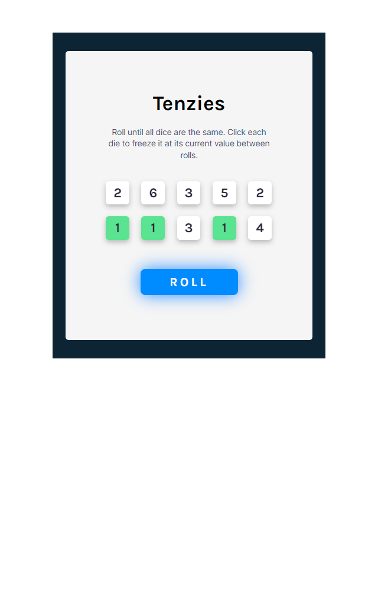
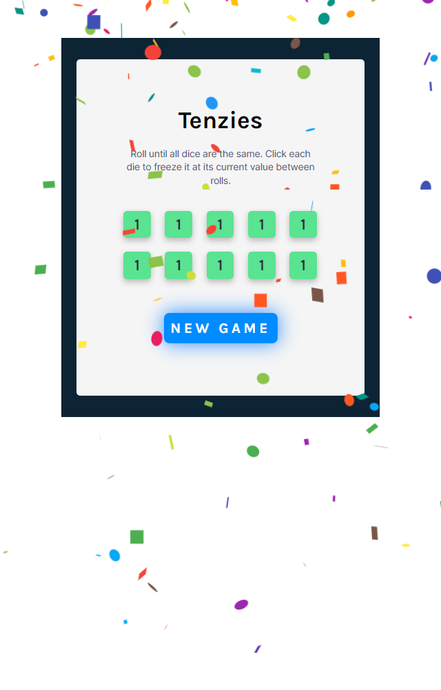

# Project Title

Tenzies Game 

## Description

This is a project from Scrimba's front end web development course modules. The aim is to try and roll ten dice that are all the same. The user clicks on each die to hold it until they have all similar die and the game is won. 

## Live Demo

Click [here](https://www.example.com) to access the live demo of the project.

## Screenshots

## Technologies Used

- React
- HTML
- CSS
- JavaScript

## Installation

To install and run the project locally, follow these steps:

1. Clone the repository: `git clone https://github.com/your-username/your-repo.git`
2. Install dependencies: `npm install`
3. Start the development server: `npm run dev`

## Contributing

Contributions are welcome! If you'd like to contribute to this project, please follow these steps:

1. Fork the repository.
2. Create a new branch: `git checkout -b feature/your-feature`
3. Commit your changes: `git commit -am 'Add your feature'`
4. Push to the branch: `git push origin feature/your-feature`
5. Submit a pull request.

## Contact

For any questions or inquiries, please feel free to reach out to me at wycliffwhite7@gmail.com
